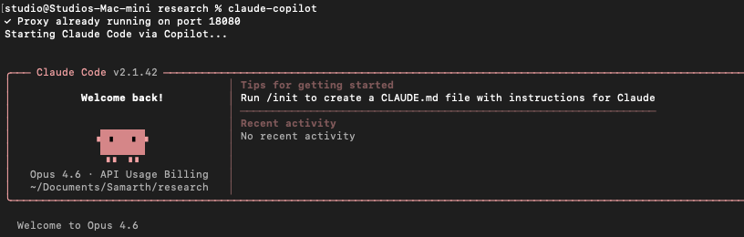

# Claude Code via GitHub Copilot

<p align="center">
  
</p>

Use **Claude Code for free** by routing it through your existing GitHub Copilot subscription.

This project runs a lightweight local proxy that translates between Anthropic's Messages API (which Claude Code speaks) and OpenAI's Chat Completions API (which GitHub Copilot speaks). No Anthropic API key needed — just your Copilot subscription.

## Features

- **Full API Translation** — Anthropic Messages API ↔ OpenAI Chat Completions, including streaming
- **Web Search** — Emulates Anthropic's `web_search_20250305` tool using DuckDuckGo Lite (free) or Brave Search API
- **Docker Support** — Run the proxy as an always-on container that survives reboots
- **Zero Dependencies** — Pure Node.js, no npm install needed

## Prerequisites

- GitHub account with an **active Copilot subscription** (Individual, Business, or Enterprise)
- [Node.js](https://nodejs.org/) 18+ (or [Docker](https://www.docker.com/))
- [Claude Code](https://docs.anthropic.com/en/docs/claude-code) installed (`npm install -g @anthropic-ai/claude-code`)

## Quick Start

### 1. Clone and authenticate
```bash
git clone https://github.com/samarth777/claude-code-copilot.git
cd claude-code-copilot
node scripts/auth.mjs
```

The auth script opens a GitHub device code flow in your browser. Your token is saved to `~/.claude-copilot-auth.json`.

### 2. Start Claude Code

**One-command launcher (recommended):**
```bash
./scripts/launch.sh
```

This auto-starts the proxy (via Docker if available, otherwise as a background process) and launches Claude Code.

**Or use Docker directly:**
```bash
docker compose up -d
ANTHROPIC_BASE_URL=http://localhost:18080 ANTHROPIC_API_KEY=copilot-proxy claude
```

The proxy runs with `restart: always` — it stays running across reboots.

### 3. Select your model

Inside Claude Code, use `/model` to switch between available models (Claude Opus, Sonnet, etc.).

## Web Search

The proxy emulates Anthropic's web search tool so Claude Code's WebSearch works automatically.

**Search providers:**
- **Brave Search API** — Best results. Set `BRAVE_API_KEY` env var (free tier: 2000 queries/month at [api.search.brave.com](https://api.search.brave.com/))
- **DuckDuckGo Lite** — Free, no API key needed (default)

## How It Works
```
┌─────────────┐    Anthropic API     ┌──────────────┐    OpenAI API      ┌──────────────────────┐
│             │    (Messages)        │              │    (Chat Compl.)   │                      │
│ Claude Code │ ──────────────────▶  │  Local Proxy │ ──────────────────▶│ api.githubcopilot.com│
│             │ ◀──────────────────  │  :18080      │ ◀──────────────────│                      │
└─────────────┘                      └──────────────┘                    └──────────────────────┘
```

Claude Code sends requests in Anthropic format → proxy translates to OpenAI format → forwarded to GitHub Copilot → responses translated back. No data is stored or logged.

## Troubleshooting

**"401 Unauthorized" from Copilot**
```bash
rm ~/.claude-copilot-auth.json
node scripts/auth.mjs
```

**"EADDRINUSE: address already in use"**
```bash
lsof -ti:18080 | xargs kill -9
```

**Proxy running but Claude Code shows errors**

Make sure both environment variables are set:
```bash
ANTHROPIC_BASE_URL=http://localhost:18080 ANTHROPIC_API_KEY=copilot-proxy claude
```

## Configuration

| Variable | Default | Description |
|---|---|---|
| `COPILOT_PROXY_PORT` | `18080` | Port for the local proxy |
| `COPILOT_AUTH_FILE` | `~/.claude-copilot-auth.json` | Path to saved OAuth token |
| `BRAVE_API_KEY` | *(none)* | Brave Search API key for web search |
| `WEB_SEARCH_MAX_RESULTS` | `5` | Max search results per query |

## License

MIT
